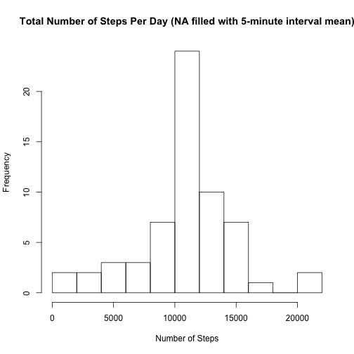

## Loading and preprocessing the data   
### 1. Loading data  

```r
zipFileName <- "activity.zip"    
csvFileName <- "activity.csv"  
activity <- read.csv(unz(zipFileName, csvFileName), colClasses=c("numeric", "character","numeric")) 
head(activity)
```

```
##   steps       date interval
## 1    NA 2012-10-01        0
## 2    NA 2012-10-01        5
## 3    NA 2012-10-01       10
## 4    NA 2012-10-01       15
## 5    NA 2012-10-01       20
## 6    NA 2012-10-01       25
```
### 2. Process/transform the data  

```r
activity$date <- as.Date(activity$date, "%Y-%m-%d")  
good <- complete.cases(activity$steps)   
activity_complete <- activity[good,]   
```
## What is mean total number of steps taken per day?  
### 1. Calculate the total number of steps taken per day  

```r
good <- complete.cases(activity$steps)  
activity_complete <- activity[good,]
library(dplyr)
steps_per_day <- activity_complete %>% group_by(date) %>% summarize(steps = sum(steps))
head(steps_per_day)
```

```
## Source: local data frame [6 x 2]
## 
##         date steps
##       (date) (dbl)
## 1 2012-10-02   126
## 2 2012-10-03 11352
## 3 2012-10-04 12116
## 4 2012-10-05 13294
## 5 2012-10-06 15420
## 6 2012-10-07 11015
```
### 2. Make a histogram of the total number of steps taken each day  

```r
hist(
        steps_per_day$steps, 
        breaks=10,  
        main="Total Number of Steps Per Day",  
        xlab="Number of Steps" ,  
        ylab="Frequency" 
        )  
```

 
### 3. Calculate and report the mean and median of the total number of steps taken per day  

```r
steps_mean <- as.character(round(mean(steps_per_day$steps),2))
steps_median <- as.character(round(median(steps_per_day$steps),2))
```
The mean of the total number of steps taken per day is 10766.19   
The median of the total number of steps taken per day is 10765  
## What is the average daily activity pattern?
### 1. Make a time series plot of the 5-minute interval (x-axis) and the average number of steps taken, averaged across all days (y-axis)  

```r
steps_per_interval <- activity_complete %>% group_by(interval) %>% summarize(steps = mean(steps))
head(steps_per_interval)
```

```
## Source: local data frame [6 x 2]
## 
##   interval     steps
##      (dbl)     (dbl)
## 1        0 1.7169811
## 2        5 0.3396226
## 3       10 0.1320755
## 4       15 0.1509434
## 5       20 0.0754717
## 6       25 2.0943396
```

```r
plot(
        steps_per_interval$interval, 
        steps_per_interval$steps,  
        type="l",
        main="Average Number of Steps Taken of 5-minute Interval",  
        xlab="5-minute Interval" ,  
        ylab="Average Number of Steps Taken" 
        ) 
```

 

### 2. Which 5-minute interval, on average across all the days in the dataset, contains the maximum number of steps?  

```r
steps_max_interval <- steps_per_interval[steps_per_interval$steps==max(steps_per_interval$steps),1]
```
The 5-minute interval that contains the maximum number of steps is 835  
## Imputing missing values
### 1. Calculate and report the total number of missing values in the dataset.  

```r
na_total <- as.character(nrow(activity) - nrow(activity_complete))
```
The total number of missing values in the dataset is 2304  
### 2. Devise a strategy for filling in all of the missing values in the dataset.    
Use the mean for that 5-minute interval to fill in all of the missing values.  
### 3. Create a new dataset that is equal to the original dataset but with the missing data filled in.  

```r
activity_na_filled <- data.frame(activity)
index <- as.vector(row(activity_na_filled))
for (i in index) {
        if (is.na(activity_na_filled[i,"steps"])) {
                activity_na_filled[i,"steps"] <- steps_per_interval[steps_per_interval$interval==activity_na_filled[i,"interval"],"steps"]
        }
}
head(activity_na_filled)
```

```
##       steps       date interval
## 1 1.7169811 2012-10-01        0
## 2 0.3396226 2012-10-01        5
## 3 0.1320755 2012-10-01       10
## 4 0.1509434 2012-10-01       15
## 5 0.0754717 2012-10-01       20
## 6 2.0943396 2012-10-01       25
```
### 4. Make a histogram of the total number of steps taken each day and Calculate and report the mean and median total number of steps taken per day. Do these values differ from the estimates from the first part of the assignment? What is the impact of imputing missing data on the estimates of the total daily number of steps?

```r
steps_per_day_na_filled <- activity_na_filled %>% group_by(date) %>% summarize(steps = sum(steps))
hist(
        steps_per_day_na_filled$steps, 
        breaks=10,  
        main="Total Number of Steps Per Day (NA filled with 5-minute interval mean)",  
        xlab="Number of Steps" ,  
        ylab="Frequency" 
        )  
```

 

```r
steps_mean_na_filled <- as.character(round(mean(steps_per_day_na_filled$steps),2))
steps_median_na_filled <- as.character(round(median(steps_per_day_na_filled$steps),2))
```
The mean of the total number of steps taken per day is 10766.19   
The median of the total number of steps taken per day is 10766.19   
These values differ slightly from the first part of the assignment and has little impact on the estimates since the 5-minute interval mean is used to fill in the missing values.   
## Are there differences in activity patterns between weekdays and weekends?  
### 1. Create a new factor variable in the dataset with two levels – “weekday” and “weekend” indicating whether a given date is a weekday or weekend day.  

```r
isWeekday <- function(d){
        if (weekdays(d) %in% c('Saturday', 'Sunday')) {
                as.factor("weekend")
        } else {
                as.factor("weekday")
        }
}
activity_na_filled$is_weekday = sapply(activity_na_filled$date,isWeekday)
head(activity_na_filled)
```

```
##       steps       date interval is_weekday
## 1 1.7169811 2012-10-01        0    weekday
## 2 0.3396226 2012-10-01        5    weekday
## 3 0.1320755 2012-10-01       10    weekday
## 4 0.1509434 2012-10-01       15    weekday
## 5 0.0754717 2012-10-01       20    weekday
## 6 2.0943396 2012-10-01       25    weekday
```
### 2. Make a panel plot containing a time series plot (i.e. type = "l") of the 5-minute interval (x-axis) and the average number of steps taken, averaged across all weekday days or weekend days (y-axis). See the README file in the GitHub repository to see an example of what this plot should look like using simulated data.  


```r
steps_per_interval_na_filled <- activity_na_filled %>% group_by(is_weekday, interval) %>% summarize(steps = mean(steps))
library(lattice)
xyplot(
        steps~interval | is_weekday, data = steps_per_interval_na_filled,
        layout = c(1,2),
        type = 'l',
        xlab = 'Interval',
        ylab = 'Number of steps'
        )
```

 
